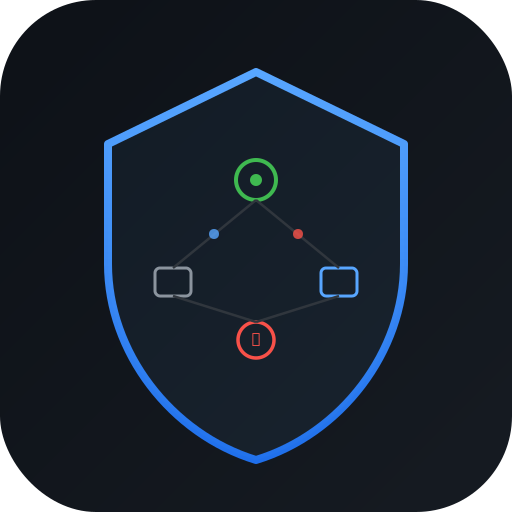
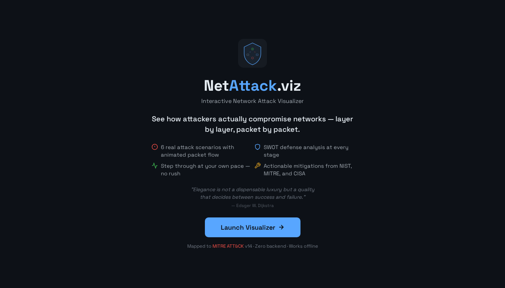
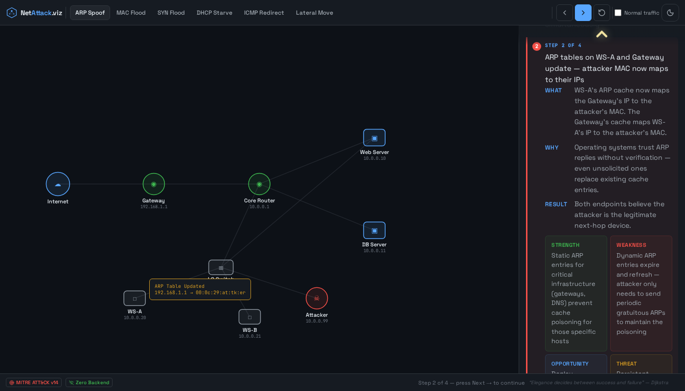
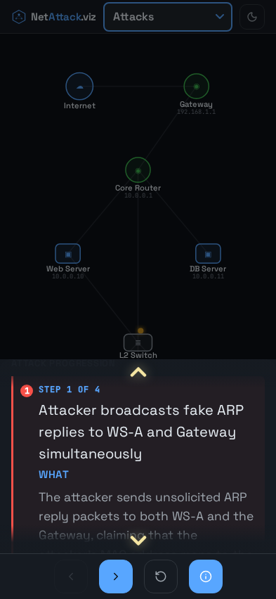

<p align="center">
  
</p>

<h1 align="center">NetAttack.viz</h1>

<p align="center">
  <strong>Interactive Layer 2/3 Network Attack Visualizer</strong><br>
  Step through real attack scenarios. See how they work. Learn how to stop them.
</p>

<p align="center">
  <a href="https://stewalexander-com.github.io/network-attack-visualizer/"></a>&nbsp;
  <a href="https://attack.mitre.org"></a>&nbsp;
  
</p>

---

## Table of Contents

- [Overview](#overview)
- [Screenshots](#screenshots)
- [Attack Scenarios](#attack-scenarios)
- [How Each Step Works](#how-each-step-works)
- [Network Topology](#network-topology)
- [Features](#features)
- [Tech Stack](#tech-stack)
- [Run Locally](#run-locally)
- [PWA / Add to Home Screen](#pwa--add-to-home-screen)
- [Social Sharing](#social-sharing)
- [Architecture Decisions](#architecture-decisions)
- [Why This Exists](#why-this-exists)
- [License](#license)

---

## Overview

NetAttack.viz is a single-file, zero-backend interactive visualization of six classic Layer 2/3 network attacks. Each attack is broken into discrete steps that animate packet flow across a network topology while explaining:

- **What** is happening at the protocol level
- **Why** the attack works (which vulnerability is exploited)
- **Result** — the observable state change
- **SWOT defense analysis** — strengths to leverage, weaknesses being exploited, opportunities to defend, and threats if unmitigated

Every attack maps to a real [MITRE ATT&CK](https://attack.mitre.org) technique ID. Detection and mitigation guidance is sourced from NIST, MITRE, and CISA best practices.

> *"Elegance is not a dispensable luxury but a quality that decides between success and failure."*
> — Edsger W. Dijkstra

---

## Screenshots

### Splash Screen
<p align="center">
  
</p>

### Desktop — Attack Step with SWOT Analysis
<p align="center">
  
</p>

### Mobile — Step-Through with Detail Drawer
<p align="center">
  
</p>

---

## Attack Scenarios

| # | Scenario | MITRE ID | Kill Chain Phase | Key Concept |
|---|---|---|---|---|
| | **Layer 2/3 Attacks** | | | |
| 1 | ARP Spoofing (MITM) | [T1557.002](https://attack.mitre.org/techniques/T1557/002/) | Collection → Credential Access | Gratuitous ARP poisons victim + gateway tables |
| 2 | MAC Flooding (CAM Overflow) | [T1498](https://attack.mitre.org/techniques/T1498/) | Defense Evasion → Discovery | CAM table overflow degrades switch to hub mode |
| 3 | SYN Flood | [T1498.001](https://attack.mitre.org/techniques/T1498/001/) | Impact | Spoofed SYN packets exhaust server half-open queue |
| 4 | DHCP Starvation + Rogue DHCP | [T1557](https://attack.mitre.org/techniques/T1557/) | Initial Access → Credential Access | Pool exhaustion enables rogue DHCP gateway injection |
| 5 | ICMP Redirect | [T1562.001](https://attack.mitre.org/techniques/T1562/001/) | Defense Evasion | ICMP Type 5 rewrites victim routing table |
| 6 | Lateral Movement (SMB/RDP) | [T1021.001](https://attack.mitre.org/techniques/T1021/001/) / [T1021.002](https://attack.mitre.org/techniques/T1021/002/) | Lateral Movement | Internal port scan → SMB pivot → credential reuse |
| | **Quantum + AI Threats** | | | |
| 7 | Harvest Now, Decrypt Later | [T1040](https://attack.mitre.org/techniques/T1040/) | Collection → Future Decryption | Passive traffic capture archived for quantum decryption |
| 8 | AI Model Poisoning | [AML.T0020](https://atlas.mitre.org/techniques/AML.T0020) | ML Attack Staging → Impact | Backdoor injected via poisoned training data |
| 9 | Indirect Prompt Injection | [AML.T0051](https://atlas.mitre.org/techniques/AML.T0051) | Initial Access → Impact | Malicious instructions planted in RAG-retrieved documents |
| 10 | AI Supply Chain Attack | [AML.T0048](https://atlas.mitre.org/techniques/AML.T0048) | Initial Access → Persistence | Poisoned model/library from public repository |

---

## How Each Step Works

Every attack is divided into 3–4 discrete steps. The user controls the pace — press **Next →** to advance, **← Prev** to go back.

Each step provides:

| Layer | What the user sees |
|---|---|
| **Animation** | Packets move across the D3 network topology showing the attack path |
| **Step Counter** | "STEP 2 OF 4" — always visible, always oriented |
| **What** | Technical explanation of the action at the protocol level |
| **Why** | Root cause — which design flaw or missing control enables it |
| **Result** | Observable state change after this step completes |
| **SWOT** | Strength (defense capability), Weakness (vulnerability), Opportunity (mitigation), Threat (consequence) |

At the final step, an **Attack Outcome** section appears with severity rating, blast radius, and prioritized recommendations.

---

## Network Topology

```
INTERNET ──── GATEWAY ──── CORE ROUTER (L3)
                                │
                      ┌─────────┤─────────┐
                   L2 SWITCH         WEB SERVER
                ┌──────┤──────┐         │
            WS-A     WS-B   ATTACKER   DB SERVER
          (victim)          (kali)
```

| Node | Type | IP | MAC |
|---|---|---|---|
| Internet | Cloud | — | — |
| Gateway | Router | 192.168.1.1 | aa:bb:cc:00:00:01 |
| Core Router | Router | 10.0.0.1 | aa:bb:cc:00:00:02 |
| L2 Switch | Switch | — | — |
| Web Server | Server | 10.0.0.10 | de:ad:be:ef:00:01 |
| DB Server | Server | 10.0.0.11 | de:ad:be:ef:00:02 |
| WS-A (victim) | Workstation | 10.0.0.20 | ca:fe:ba:be:00:01 |
| WS-B | Workstation | 10.0.0.21 | ca:fe:ba:be:00:02 |
| Attacker (Kali) | Attacker | 10.0.0.99 | 00:0c:29:at:tk:er |

Tap any node during an attack to see its IP, MAC, role, and compromise state.

---

## Features

### Core
- **10 animated attack scenarios** — step-through at your own pace
- **38 detailed steps** with What/Why/Result explanations
- **SWOT defense analysis** at every step (collapsible on mobile)
- **MITRE ATT&CK mapping** with clickable technique IDs
- **Detection + Mitigation** callouts per scenario
- **Attack Outcome** with severity, scope, and recommendations

### Design
- **Poka-yoke controls** — invalid actions are disabled, not hidden
- **Self-documenting UI** — every state tells you what to do next
- **Dark/Light mode** toggle
- **Responsive** — portrait mobile, landscape, tablet, desktop
- **PWA** — add to home screen, works offline

### Engineering
- **Single file** — all HTML/CSS/JS inline (~130KB)
- **Zero backend** — pure static, no build step, no bundler
- **CDN fallbacks** — jsDelivr → cdnjs/unpkg with graceful degradation
- **Fault-tolerant** — `safeExec` wraps all animation chains
- **Page Visibility API** — pauses when tab is hidden
- **Debounced resize** — no layout thrashing
- **`prefers-reduced-motion`** respected
- **Safe area insets** for notched phones

---

## Tech Stack

| Library | Purpose |
|---|---|
| [D3.js v7](https://d3js.org/) | Network graph rendering + packet animation |
| [Lucide Icons](https://lucide.dev/) | UI icons (node types, controls) |
| [Space Grotesk](https://fonts.google.com/specimen/Space+Grotesk) | UI typography |
| [JetBrains Mono](https://fonts.google.com/specimen/JetBrains+Mono) | Code, IPs, MACs, protocol labels |
| GitHub Actions | Auto-deploy to GitHub Pages on push |

No React. No build step. No bundler. No Node.

---

## Run Locally

```bash
git clone https://github.com/StewAlexander-com/network-attack-visualizer
cd network-attack-visualizer
python3 -m http.server 8080
# Open http://localhost:8080
```

Or open `index.html` directly — works from `file://`.

---

## PWA / Add to Home Screen

The app is a Progressive Web App with a service worker for offline use.

**iPhone**: Safari → Share → Add to Home Screen → "NetAttack.viz"

**Android**: Chrome → Menu → Add to Home Screen

The app icon is a network-in-shield design that matches the in-app logo.

---

## Social Sharing

Open Graph and Twitter Card meta tags are included. Sharing the link on LinkedIn, Facebook, Messenger, Slack, Discord, iMessage, or X/Twitter will show:

- **Title**: NetAttack.viz — Interactive Network Attack Visualizer
- **Description**: See how attackers actually compromise networks — layer by layer, packet by packet.
- **Image**: 1200×630 branded preview card

---

## Architecture Decisions

| Decision | Rationale |
|---|---|
| Single HTML file | Zero deployment complexity. Copy one file, it works everywhere. |
| Step-through (not auto-play) | Users absorb more when they control pace. Based on user testing. |
| SWOT per step (not per attack) | Defenses are context-dependent. ARP step 1 needs different controls than step 3. |
| Poka-yoke button states | Disabled buttons > hidden buttons. User sees the full control set, understands the flow. |
| 125% base font on mobile | Tested with users wearing glasses. Readability > information density. |
| Collapsible SWOT on mobile | 4 stacked cards exceed 40vh drawer. Collapse keeps the drawer manageable. |
| CDN with fallback chain | jsDelivr → cdnjs → unpkg. App must load even if one CDN is down. |
| No framework | D3 is the only dependency that earns its place. Everything else is vanilla. |

---

## Why This Exists

This project activates five leverage types simultaneously:

- **Time** — runs without me, explains L2/L3 attacks 24/7
- **Financial** — live demo closes consulting conversations faster than a resume bullet
- **Network** — bridges ops and security audiences in one artifact
- **Knowledge** — D3 packet animation proves depth without claiming it
- **Strategic** — compounding SEO + GitHub stars asset that increases in value over time

---

## License

MIT
